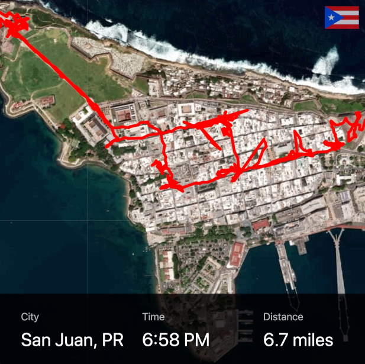

# Strava Animator

Make animations based on your Strava data, such as:

- [Seattle run animation](https://twitter.com/dbabbs/status/1171248705686704130/)
- [Mumbai walk animation](https://twitter.com/dbabbs/status/1142036330957815808)
- [San Juan walk animation](https://twitter.com/dbabbs/status/1112067431646806016)

## Instructions

1. Download GPX data from Strava
2. Convert to GeoJSON using [this tool](https://mapbox.github.io/togeojson/)
3. Replace `data.json` with the converted data
4. Set the map center in `index.js`
5. Open up browser and press space bar to start animation
6. I recommend opening developer tools to set the window size for a good aspect ratio